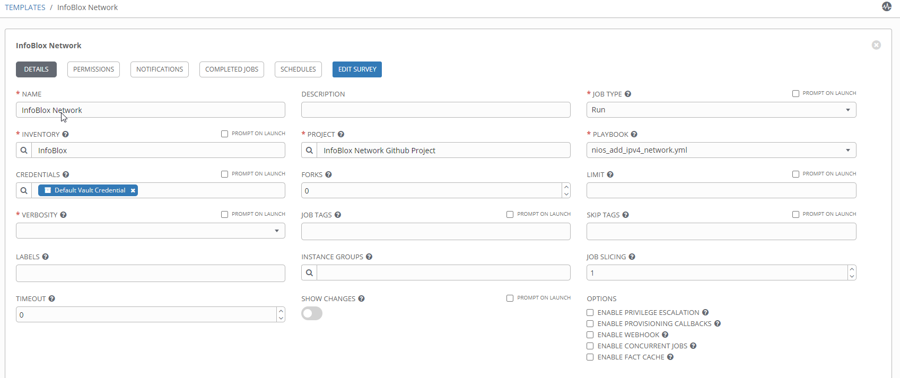
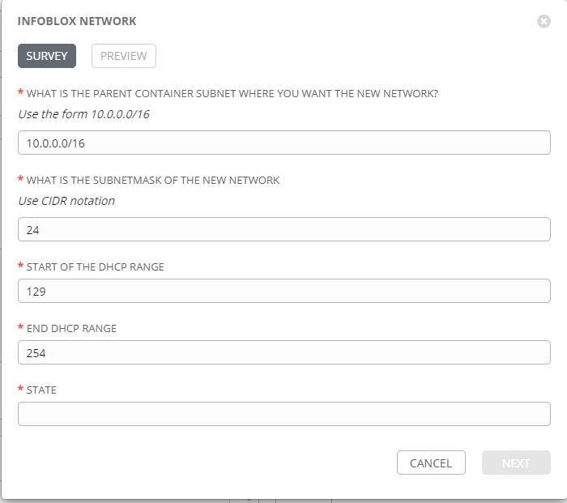
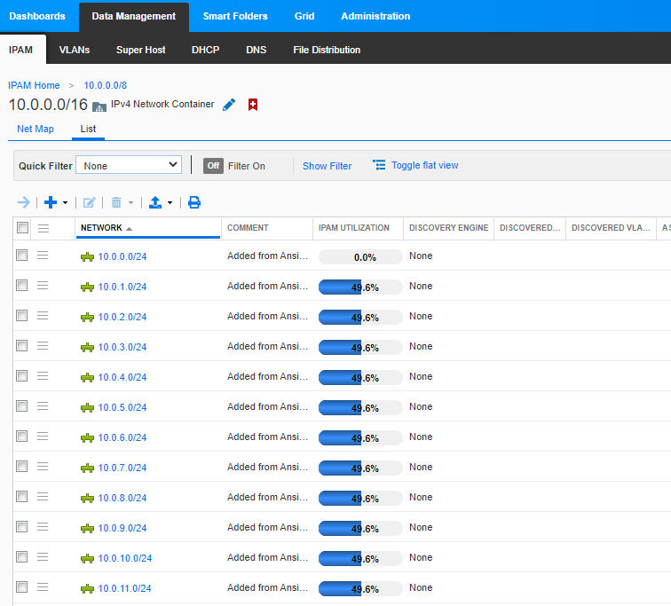
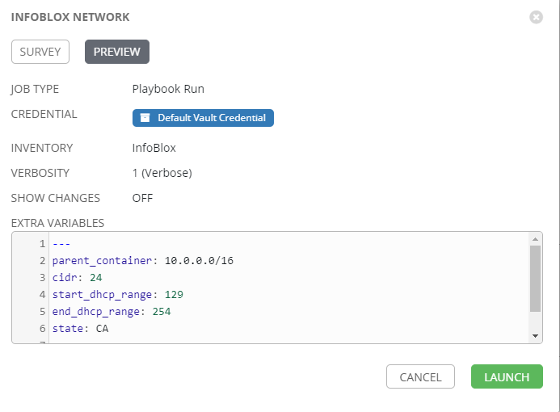
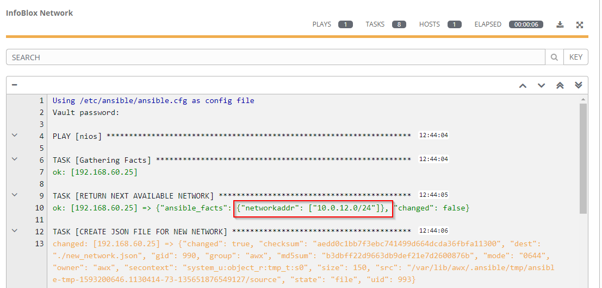
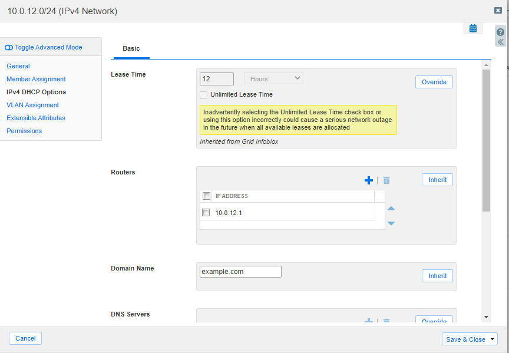

#  Automating IPAM with Ansible

One of the more error-prone and mundane tasks a system administrator is tasked with is IP Administration. Care needs to be taken that IP addresses are assigned accurately and promptly. As complexity grows, it becomes increasingly difficult for administrators to keep track of IP changes by hand.  This inevitably leads to a centralized tool, such as InfoBlox, being used to track IP assignments.  While this alleviates some of the complexity, there is still room for human error.  IP addresses might not be retired properly.  Inexperienced admins may assign IPs from an incorrect subnet.  A device can be moved without letting network administrators know about the change. As the source of truth drifts from reality, the chance of an outage or other system failure increases. 

The complexities of a particular environment take time to learn as well.  Does the new branch office in Boise get an IP subnet from the mid-west region, or is it part of the Pacific Northwest?   What IP should be assigned to the new firewall in the Seattle Datacenter?  How many exceptions to the rules do we allow before no one can understand the system as a whole?

With Ansible and InfoBlox, we can automate these decisions and take some of the guesswork out the process.  We can use Ansible Tower to create Surveys that will allow anyone with a passing knowledge of IP addresses to request, assign, and manage the IPs they need to complete their work.  This frees up time for system admins to work on bigger projects and reduces the chance of human error.  

This tutorial is meant as an introduction to how one can manage IPs with Ansible and InfoBlox, and thus overcome some of the problems inherent in manual IP assignment.  You should have access to InfoBlox and Ansible Tower, preferably in a lab environment.   We will walk through setting up the Ansible control host to connect to InfoBlox, creating credentials, and assigning a new subnet from a pre-defined pool of available IPs.   We will also create a DHCP range and show how you can assign extensible attributes automatically.  We will create a Survey in Ansible Tower that will anyone to create a new IP network in InfoBlox.

## Reqirements

You should already be familiar with creating assets in Ansible Tower and know how InfoBlox IPAM works.  

First, install the infoblox-client on your Ansible Tower server. This will install the python libraries necessary for Ansible to communicate with InfoBlox.

```bash
$ sudo pip install infoblox-client
```

Next, we need to create credentials so Ansible Tower can connect to InfoBlox.  For simplicity, I have put my credentials in a `group_vars/nios.yml` file.  

I would also recommend encrypting this file with ansible-vault.  In a production environment, you will probably want to create a custom credential for InfoBlox within Ansible Tower.

We will create a few files for this lab, so I will use the standard of putting the file name to be created before the code as follows:

Do not put the file name in the file.


```yaml
group_vars/nios.yml

---
nios_provider:
  host: 192.168.1.20
  username: admin
  password: infoblox
```
## Adding an ipv4 network

To start our playbook, we'll assign some default values for testing.  These can be overridden later in Tower with a Survey. 

Create a new file called `nios_add_ipv4_network.yml` 

```yaml
nios_add_ipv4_network.yml

---
- hosts: nios
  connection: local

  vars:
    cidr: 24
    parent_container: 10.0.0.0/16
    start_dhcp_range: 100
    end_dhcp_range: 254
    region: North America
    country: USA
    state: CA
```
***

The first thing we need to do is query InfoBlox for the next available subnet within our parent container.  Add the following lines to your playbook.  This will return the next available /24 (our cidr variable above) in the format 10.0.12.0/24 and assign it to the networkaddr variable.

```yaml
tasks:
        
    - name: RETURN NEXT AVAILABLE NETWORK
      set_fact:
        networkaddr: "{{ lookup('nios_next_network', parent_container, cidr=cidr, provider=nios_provider) }}"
```
***

You can create the network with the `nios_network` module, but at this time the module does not support assigning the network to a grid member.  For that, we need to use the InfoBlox API and the Ansible uri module to make the change.

We will use a jinja2 template to create the json file necessary for our change.

```jinja2
templates/net_network.j2

{
    "network": "{{ networkaddr[0] }}",
    "members": [
       {
          "_struct": "dhcpmember",
          "ipv4addr" : "{{ nios_provider.host }}"
       }
    ]
 }
```

The output from our template will create a json file that will look like this

```jinja2
{
    "network": "10.0.12.0/24",
    "members": [
       {
          "_struct": "dhcpmember",
          "ipv4addr" : "192.168.1.20"
       }
    ]
 }
 ```

***

Add the following to your playbook to create the network.

```yaml
- name: CREATE JSON FILE FOR NEW NETWORK
      template:
        src: templates/new_network.j2
        dest: new_network.json
      
- name: CREATE NETWORK OBJECT AND ASSIGN GRID MEMBER
    uri:
      url: https://{{ nios_provider.host }}/wapi/v{{ nios_provider.wapi_version }}/network
      method: POST
      user: "{{ nios_provider.username }}" 
      password: "{{ nios_provider.password }}"
      body: "{{ lookup('file','new_network.json') }}"
      body_format: json
      status_code: 201
      validate_certs: false
```
***

Now that we have a network created, let's create a DHCP range.  We can use the InfoBlox API for this task as well.

First, create the template file.

```jinja2
templates/new_lan_range.j2

{
     "start_addr": "{{ networkaddr[0] | ipaddr(start_dhcp_range) | ipaddr('address') }}",
     "end_addr": "{{ networkaddr[0] | ipaddr(end_dhcp_range) | ipaddr('address') }}",
     "server_association_type": "MEMBER" ,
     "member": 
        {
           "_struct": "dhcpmember",
           "ipv4addr" : "{{ nios_provider.host }}"
        }
     
  }
```

Our json file will look like the following.

```jinja2
{
     "start_addr": "10.0.12.100",
     "end_addr": "10.0.12.254",
     "server_association_type": "MEMBER" ,
     "member": 
        {
           "_struct": "dhcpmember",
           "ipv4addr" : "192.168.1.20"
        }
     
  }
```
***

Then add the following to your playbook.

```yaml
- name: CREATE JSON FILE FOR NEW DCHP RANGE
      template:
        src: templates/new_lan_range.j2
        dest: new_lan_range.json

- name: CREATE DHCP RANGE FOR NEW NETWORK
    uri:
      url: https://{{ nios_provider.host }}/wapi/v{{ nios_provider.wapi_version }}/range
      method: POST
      user: "{{ nios_provider.username }}" 
      password: "{{ nios_provider.password }}"
      body: "{{ lookup('file','new_lan_range.json') }}"
      body_format: json
      status_code: 201
      validate_certs: false
```
***

Now that we have our new network created and have assigned a DHCP range, we can add in some details with the `nios_network` module. Here is where you can configure DHCP options and update your extensible attributes.  

```yaml
- name: UPDATE NEW NETWORK
  nios_network:
    network: "{{ item }}"
    comment: Added from Ansible
    extattrs:
      Region: "{{ region }}"
      Country: "{{ country }}"
      State: "{{ state }}"
    options:
      - name: domain-name
        value: example.com
      - name: routers
        value: "{{ item | ipaddr('1') | ipaddr('address') }}"
    state: present
    provider: "{{ nios_provider }}"
  loop: "{{ networkaddr }}"
```
***

We should tell InfoBlox to restart the DHCP service since there was a change.  The section `grid/b25lLmNsdXN0ZXIkMA` may differ for your installation.  Please refer to the InfoBlox documentation on how to determine this value.


```yaml
 - name: RESTART DHCP SERVICE
      uri:
        url: https://{{ nios_provider.host }}/wapi/v{{ nios_provider.wapi_version }}/grid/b25lLmNsdXN0ZXIkMA:Infoblox?_function=restartservices
        method: POST
        user: "{{ nios_provider.username }}" 
        password: "{{ nios_provider.password }}"
        body: "{{ lookup('file','restart_dhcp_service.json') }}"
        body_format: json
        status_code: 200
        validate_certs: false
```
***

Once the file is complete, you can push it to your source code repository.

In Ansible Tower, we will create a Job Template and Survey so anyone can create a new network in InfoBlox.

In Ansible Tower, create a new inventory with your InfoBlox server as the host and a group called nios.  Our playbook references that group, so the name should match our playbook host statement. 

You will also need to create a new Project that points to your source control.


Create a job template for your new playbook. If you encrypted your `nios.yml` file with ansible-vault, you will have to provide your Vault credentials here.



***

Add a survey so the user can choose where they need the new subnet created and customize any extensible attributes. A feature enhancement to the playbook would be to add logic that restricts where subnets can be created based on state, region, or other criteria.  An example survey is below.



***

Before we launch our Job Template, let's take a look at InfoBlox and see what existing networks we have.

You can see that 10.0.12.0/24 is the next available network.  



***

 Back in Ansible Tower, set the verbosity of your Job to 1 and launch.



*** 

You can see the next available network in the output



***

In InfoBlox, examine the network and verify the changes have been made.



***

## Next Steps

From here, you should be able to add additional tasks that can create host records or update existing networks. Add tests to make sure the parent container is valid based on some criteria, such as state or region. Try to write a playbook that updates the extensible attributes of an existing network.  

Any automation journey should start with small wins.  With the help of Ansible and InfoBlox, you can automate a few small tasks today, and tomorrow you will have a fully automated IPAM solution.


## References

[Github Repo ](https://github.com/gejames/infoblox_networks)

[InfoBlox API Documentaion](https://www.infoblox.com/wp-content/uploads/infoblox-deployment-infoblox-rest-api.pdf)

[Ansible InfoBlox Guide](https://docs.ansible.com/ansible/latest/scenario_guides/guide_infoblox.html)

[Ansible NIOS Modules](https://docs.ansible.com/ansible/latest/modules/list_of_net_tools_modules.html#nios)

[ipaddr jinja2 filter](https://docs.ansible.com/ansible/latest/user_guide/playbooks_filters_ipaddr.html)


